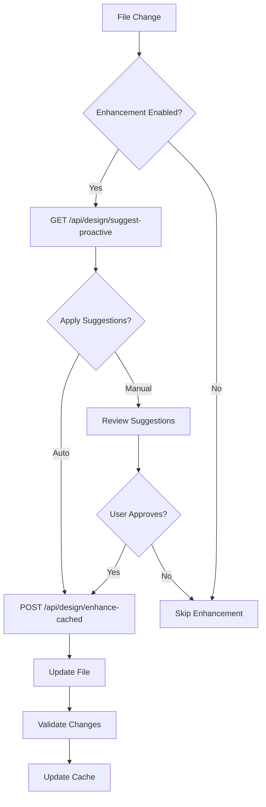
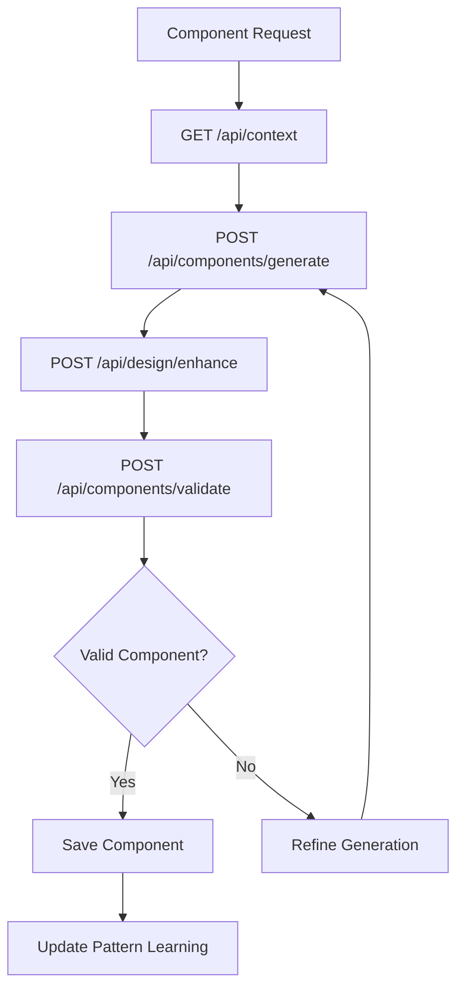

# AI Agent Workflows and Decision Matrices

This section provides comprehensive decision-making frameworks for AI agents working with the AI-Driven Design Automation System. These workflows help agents make appropriate choices about when, how, and why to use different features of the system.

## Overview

The AI-Driven Design Automation System has 59 endpoints across 8 functional areas. AI agents need clear guidance on:

- **When** to use each endpoint
- **How** to structure API calls
- **Why** certain approaches are preferred
- **What** outcomes to expect

## Functional Areas

### 1. Health & Context (7 endpoints)
- System health monitoring
- Project context resolution
- Configuration validation

### 2. Design Enhancement (12 endpoints) 
- CSS transformation and optimization
- Token application and validation
- Batch processing workflows

### 3. Brand Pack Management (9 endpoints)
- Brand pack CRUD operations
- Validation and testing
- Migration and versioning

### 4. Component Operations (8 endpoints)
- Component generation and enhancement
- Pattern recognition and application
- Library integration

### 5. Pattern Learning (6 endpoints)
- Design pattern analysis
- Machine learning model training
- Usage analytics

### 6. Semantic Analysis (5 endpoints)
- Code semantic understanding
- Accessibility compliance
- SEO optimization

### 7. Preview & Testing (7 endpoints)
- Live preview generation
- Visual regression testing
- Performance monitoring

### 8. Real-time Features (5 endpoints)
- WebSocket connections
- Live collaboration
- Hot module replacement

## Decision Matrix Framework

### Project Setup Decision Tree

```
New Project Setup
├── Analyze project type
│   ├── Web Application → web-app template
│   ├── Component Library → component-library template  
│   ├── Marketing Site → marketing-site template
│   └── Dashboard → dashboard template
├── Check for existing brand pack
│   ├── Found → Use GET /api/brand-packs/{id}
│   ├── Not Found → Create with POST /api/brand-packs
│   └── Multiple Found → Resolve with GET /api/context
└── Initialize configuration
    ├── Copy template files
    ├── Replace placeholders
    └── Validate with GET /api/health
```

### Enhancement Workflow Decision Matrix

| Scenario | Endpoint | When to Use | Expected Outcome |
|----------|----------|-------------|------------------|
| Single CSS file enhancement | POST /api/design/enhance | File < 1000 lines, immediate feedback needed | Enhanced CSS with design tokens |
| Bulk file processing | POST /api/design/enhance-cached | Multiple files, performance critical | Batch processed files with caching |
| Proactive suggestions | GET /api/design/suggest-proactive | Development mode, learning enabled | Design improvement recommendations |
| Validation only | POST /api/design/validate | Pre-deployment, CI/CD pipeline | Compliance report without changes |

### Brand Pack Decision Matrix

| Action | Endpoint | Trigger Conditions | Prerequisites |
|--------|----------|-------------------|---------------|
| Create new | POST /api/brand-packs | No existing pack, new project | Project analysis complete |
| Fetch existing | GET /api/brand-packs/{id} | Known brand pack ID | Valid project context |
| Update tokens | PUT /api/brand-packs/{id} | Design system evolution | Backup existing pack |
| Validate | POST /api/brand-packs/validate | Before deployment | Complete brand pack JSON |

## Workflow Patterns

### 1. Initial Project Setup

```mermaid
graph TD
    A[New Project] --> B[Analyze Requirements]
    B --> C{Project Type?}
    C -->|Web App| D[web-app template]
    C -->|Component Library| E[component-library template]
    C -->|Marketing| F[marketing-site template]
    C -->|Dashboard| G[dashboard template]
    D --> H[Check Brand Pack]
    E --> H
    F --> H
    G --> H
    H --> I{Brand Pack Exists?}
    I -->|Yes| J[GET /api/brand-packs/{id}]
    I -->|No| K[Create Brand Pack]
    J --> L[Initialize Config]
    K --> L
    L --> M[Validate Setup]
```

### 2. Development Workflow



### 3. Component Generation Workflow



## API Usage Guidelines

### Authentication & Headers
```javascript
const headers = {
  'Content-Type': 'application/json',
  'X-Agentic-Version': '1.0.0',
  'X-Project-Context': projectId // if available
};
```

### Error Handling Patterns
```javascript
try {
  const response = await fetch('/api/design/enhance', {
    method: 'POST',
    headers,
    body: JSON.stringify(payload)
  });
  
  if (!response.ok) {
    const error = await response.json();
    // Handle specific error types
    switch (error.code) {
      case 'BRAND_PACK_NOT_FOUND':
        // Fallback to default or create new
        break;
      case 'VALIDATION_FAILED':
        // Show validation errors to user
        break;
      case 'RATE_LIMIT_EXCEEDED':
        // Implement backoff strategy
        break;
    }
  }
} catch (error) {
  // Handle network errors
}
```

### Caching Strategy
- Use cached endpoints for repeated operations
- Implement client-side caching for brand pack data
- Respect cache headers and TTL values
- Clear cache on brand pack updates

## Performance Considerations

### Batch Operations
- Use batch endpoints when processing multiple files
- Implement request queuing for large operations
- Monitor performance metrics with GET /api/performance

### Rate Limiting
- Respect rate limits (typically 100 requests/minute)
- Implement exponential backoff for retries
- Use WebSocket connections for real-time features

### Error Recovery
- Always have fallback strategies
- Graceful degradation when system is unavailable
- Preserve user work during system failures

## Common Patterns

### Pattern 1: Safe Auto-Enhancement
```javascript
// Check if enhancement is safe before applying
const suggestions = await api.getSuggestions(cssContent);
if (suggestions.safety.score > 0.8 && suggestions.changes.length <= 5) {
  const enhanced = await api.enhance(cssContent, { autoApply: 'safe' });
  return enhanced;
}
// Otherwise, require manual approval
```

### Pattern 2: Progressive Enhancement
```javascript
// Start with basic enhancement, then add advanced features
let content = originalCss;
content = await api.enhance(content, { level: 'basic' });
content = await api.enhance(content, { level: 'advanced' });
content = await api.validate(content);
```

### Pattern 3: Context-Aware Processing
```javascript
// Use project context to inform enhancement decisions
const context = await api.getContext();
const enhancementConfig = {
  brandPackId: context.brandPack.id,
  projectType: context.type,
  features: context.enabledFeatures
};
const enhanced = await api.enhance(cssContent, enhancementConfig);
```

## Decision Support Tools

### When to Create vs. Update Brand Packs
- **Create new**: New project, different target audience, major rebrand
- **Update existing**: Token refinement, new component patterns, minor adjustments

### When to Use Auto vs. Manual Enhancement
- **Auto**: Development environment, safe changes, established patterns
- **Manual**: Production environment, major changes, new patterns

### When to Use Real-time Features
- **WebSockets**: Team collaboration, live preview, immediate feedback
- **Polling**: Background processing, status updates, non-critical updates

This framework should guide AI agents in making appropriate decisions when working with the design automation system.