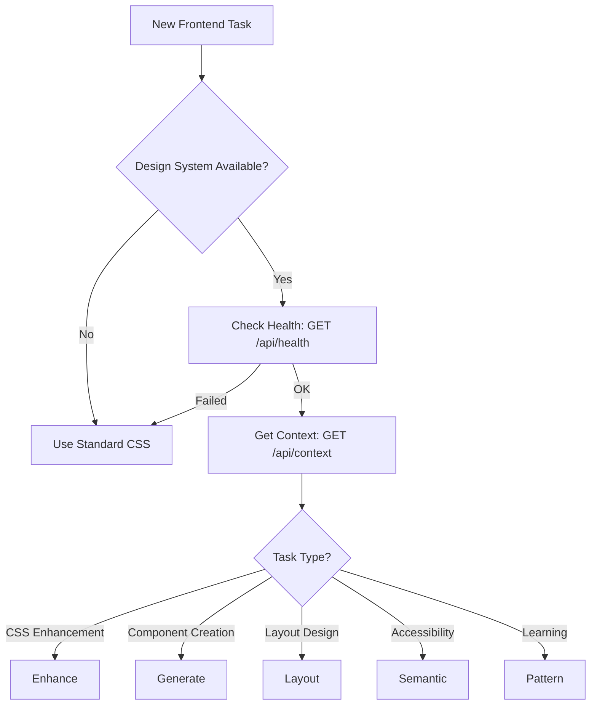

# AI Agent Instructions - Agentic Design System

This document provides comprehensive decision intelligence for AI agents using the Agentic Design System. The system has 59 fully functional API endpoints for automated design enhancement, component generation, and intelligent CSS transformation.

## Quick Start Decision Tree



## System Prerequisites

1. **Service Running**: Agentic server at `http://localhost:8901`
2. **MongoDB**: Available at `mongodb://localhost:27017`
3. **Brand Pack**: Configured via `.agentic/config.json`
4. **API Key**: For AI features, set `ANTHROPIC_API_KEY`

## Core Decision Framework

### 1. CSS Enhancement (When & How)

**DECISION: Which enhancement endpoint to use?**

```javascript
// Decision Logic
if (needAllTransformations && production) {
  use('/api/design/enhance-advanced'); // 19ms - Typography, animations, gradients, states, optimization
} else if (cssWillBeReusedMultipleTimes) {
  use('/api/design/enhance-cached'); // 5ms - With caching for performance
} else if (oneTimeTransformation) {
  use('/api/design/enhance'); // 7ms - Basic token replacement
} else if (onlyNeedAnalysis) {
  use('/api/design/analyze'); // 1ms - Metrics only, no changes
}
```

**Quality Gates for Enhancement:**
- ✅ Brand compliance score > 0.8
- ✅ Changes array not empty
- ✅ No syntax errors in output
- ✅ Maintains AA contrast ratios

**Example API Call:**
```javascript
POST /api/design/enhance-cached
{
  "code": ".btn { color: red; padding: 10px; }",
  "brandPackId": "western-companies",
  "projectPath": "/current/project",
  "componentType": "button"  // Helps with contextual enhancements
}
```

### 2. Component Generation (AI vs Templates)

**DECISION: Generate new or use template?**

```javascript
// Decision Logic
if (needFullyCustomComponent && canWait) {
  use('/api/design/generate-component'); // 14,017ms - AI generation with Claude
  // Provides: HTML, CSS, JSX, Vue, Svelte versions
} else if (standardComponentExists) {
  const templates = await fetch('/api/design/templates?type=button'); // 2ms
  use('/api/design/customize-template'); // Fast customization
} else if (needPreview) {
  use('/api/design/create-sandbox'); // Interactive sandbox
}
```

**When to use AI Generation:**
- ✅ Unique component requirements
- ✅ Time budget > 15 seconds
- ✅ Need multiple framework outputs
- ✅ Custom accessibility requirements

**When to use Templates:**
- ✅ Standard UI patterns (buttons, cards, forms)
- ✅ Need sub-second response
- ✅ Consistent with existing components
- ✅ Production deployment

### 3. Pattern Learning Integration

**DECISION: Should I learn from existing code?**

```javascript
// Decision Logic
if (existingCodebase && wantConsistency) {
  // Step 1: Batch learn patterns
  use('/api/design/patterns/:projectId/batch-learn'); // 44ms
  
  // Step 2: Get correlations
  const correlations = await fetch('/api/design/patterns/:projectId/correlations'); // 8ms
  
  // Step 3: Apply learned patterns
  use('/api/design/suggest-proactive'); // 1ms - Get suggestions
  
  // Step 4: Track usage
  use('/api/design/patterns/track'); // 2ms - Fire and forget
}
```

**Pattern Learning Benefits:**
- 🎯 Maintains codebase consistency
- 🎯 Improves over time with feedback
- 🎯 Suggests contextual improvements
- 🎯 Identifies design system violations

### 4. Layout Intelligence

**DECISION: Analyze or generate layouts?**

```javascript
// Decision Logic  
if (existingLayoutNeedsAnalysis) {
  use('/api/layout/analyze'); // 37ms - Comprehensive analysis
  // Returns: layout type, responsive behavior, accessibility score
} else if (needNewLayout) {
  if (standardLayoutPattern) {
    use('/api/layout/apply-template'); // 1ms - Pre-built layouts
  } else {
    use('/api/layout/generate-grid'); // 2ms - Custom grid system
  }
} else if (needGridRecommendations) {
  use('/api/layout/grid-recommendations'); // Intelligent suggestions
}
```

**Layout Template Categories:**
- `hero-section` - Landing page heroes
- `sidebar-layout` - Content with sidebar
- `card-grid` - Responsive card layouts
- `dashboard-layout` - Admin dashboards

### 5. Semantic & Accessibility

**DECISION: Which semantic analysis to run?**

```javascript
// Decision Logic
if (needComprehensiveReport) {
  use('/api/semantic/analyze'); // 29ms - Full analysis with components & relationships
  use('/api/semantic/accessibility-report'); // 6ms - WCAG compliance report
} else if (quickValidation) {
  use('/api/semantic/quick-accessibility-check'); // 6ms - Common issues only
} else if (needAriaEnhancements) {
  use('/api/semantic/generate-aria'); // 5ms - Auto-generate ARIA attributes
} else if (batchProcessing) {
  use('/api/semantic/batch-analyze'); // Efficient for multiple pages
}
```

**Accessibility Thresholds:**
- 🎯 WCAG AA minimum for production
- 🎯 Score > B+ for user-facing content
- 🎯 Zero high-severity issues
- 🎯 All images have alt text

### 6. Advanced Transformations

**DECISION: Which transformations to apply?**

```javascript
// Transformation Selection
const transformations = {
  typography: fileHasFontSizes,      // 7ms - Scale system
  animations: fileHasTransitions,    // 5ms - Smooth transitions
  gradients: fileHasSolidColors,     // 6ms - Brand gradients
  states: fileHasInteractive,        // 5ms - Hover/active states
  optimization: alwaysInProduction   // 2ms - Minification
};

if (Object.values(transformations).every(v => v)) {
  use('/api/design/enhance-advanced', {
    enableTypography: true,
    enableAnimations: true,
    enableGradients: true,
    enableStates: true,
    enableOptimization: true
  }); // 19ms - All transformations
} else {
  // Use individual endpoints for specific needs
}
```

## Performance Optimization Strategies

### Cache-First Approach
```javascript
// Always prefer cached endpoints for repeated operations
const endpoints = {
  'enhance': 7,           // ms without cache
  'enhance-cached': 5,    // ms with cache
  'templates': 2,         // ms pre-cached
  'analyze': 1           // ms metrics only
};
```

### Parallel API Calls
```javascript
// Execute independent calls in parallel
const [context, templates, patterns] = await Promise.all([
  fetch('/api/context'),
  fetch('/api/design/templates'),
  fetch('/api/design/patterns/learned')
]);
```

### Batch Processing
```javascript
// Use batch endpoints for multiple items
await fetch('/api/design/enhance-batch', {
  method: 'POST',
  body: JSON.stringify({
    files: [/* multiple CSS files */]
  })
}); // More efficient than individual calls
```

## Error Handling & Recovery

### Service Unavailable
```javascript
try {
  const health = await fetch('http://localhost:8901/api/health');
  if (!health.ok) throw new Error('Service down');
} catch (error) {
  // Fallback: Continue without enhancement
  console.warn('Agentic service unavailable, using standard CSS');
  return originalCSS;
}
```

### Degraded Mode
```javascript
if (context.degraded || !context.mongoAvailable) {
  // Use basic enhancement only (no patterns, no AI)
  // Tokens still work via config files
}
```

### Quality Validation Failed
```javascript
if (result.brandCompliance?.score < 0.8) {
  // Revert to original or request manual review
  console.warn('Brand compliance too low:', result.brandCompliance.score);
  return originalCSS;
}
```

## Project Type Detection

### Static HTML Projects
```javascript
if (projectType === 'static-html') {
  // Client-side API calls via fetch()
  // Load brand tokens as CSS variables
  // Use vanilla JS for interactions
}
```

### Next.js Projects
```javascript
if (projectType === 'nextjs') {
  // Server-side enhancement at build time
  // API routes for client-side generation
  // React component integration
}
```

### Vue/React/Angular Projects
```javascript
if (frameworkType) {
  // Use framework-specific component generation
  // Integrate with build pipeline
  // Component-level enhancement
}
```

## Brand Pack Management

### Auto-Discovery Priority
1. Environment: `AGENTIC_BRAND_PACK_ID`
2. Config: `.agentic/config.json`
3. Package: `package.json` → `agentic` field
4. Marker: `brand-pack.ref.json`
5. MongoDB: Project mapping
6. Auto-bind: Single pack scenario

### Brand Pack Operations
```javascript
// List available packs
GET /api/brand-packs

// Get specific pack
GET /api/brand-packs/:id

// Export as CSS
GET /api/brand-packs/:id/export/css

// Export as JSON
GET /api/brand-packs/:id/export/json

// Generate from logo (24s - AI powered)
POST /api/brand-packs/generate-from-logo
```

## Common Workflows

### 1. New Component Creation
```javascript
// Workflow for creating a new button component
async function createButton(description) {
  // Step 1: Generate component
  const component = await generateComponent({
    description,
    componentType: 'button',
    framework: 'react'
  });
  
  // Step 2: Validate accessibility
  const accessibility = await analyzeAccessibility(component.html);
  
  // Step 3: Visual preview
  const preview = await createSandbox(component);
  
  // Step 4: Apply to project
  if (component.brandCompliance.score > 0.8) {
    return component;
  }
}
```

### 2. CSS Migration
```javascript
// Workflow for migrating existing CSS
async function migrateCSS(cssFile) {
  // Step 1: Analyze current CSS
  const analysis = await analyzeCSS(cssFile);
  
  // Step 2: Learn patterns
  await batchLearnPatterns(analysis.patterns);
  
  // Step 3: Enhance with all transformations
  const enhanced = await enhanceAdvanced(cssFile);
  
  // Step 4: Validate changes
  const diff = await visualDiff(cssFile, enhanced);
  
  // Step 5: Optimize
  const optimized = await optimize(enhanced);
  
  return optimized;
}
```

### 3. Accessibility Audit
```javascript
// Workflow for accessibility compliance
async function auditAccessibility(html) {
  // Step 1: Full semantic analysis
  const semantic = await analyzeSemantic(html);
  
  // Step 2: Generate ARIA enhancements
  const enhanced = await generateARIA(html);
  
  // Step 3: Get WCAG report
  const report = await accessibilityReport(html, 'AA');
  
  // Step 4: Apply fixes
  if (report.wcagCompliance.AA) {
    return enhanced;
  }
}
```

## Monitoring & Metrics

### Track Performance
```javascript
const metrics = {
  cacheHitRate: 0,
  averageResponseTime: 0,
  brandComplianceScore: 0,
  accessibilityScore: 0
};

// Monitor each API call
const start = Date.now();
const result = await enhance(css);
metrics.averageResponseTime = Date.now() - start;
metrics.cacheHitRate = result.cacheHit ? 1 : 0;
```

### Pattern Learning Feedback
```javascript
// Submit feedback to improve system
await fetch('/api/design/feedback', {
  method: 'POST',
  body: JSON.stringify({
    patternId: 'btn-primary-pattern',
    feedback: 'positive',
    context: { action: 'applied_suggestion' }
  })
});
```

## Best Practices

### DO
- ✅ Check health before starting work
- ✅ Use cached endpoints for repeated operations
- ✅ Validate brand compliance scores
- ✅ Batch process multiple files
- ✅ Submit feedback for pattern improvements
- ✅ Handle errors gracefully
- ✅ Use appropriate timeouts for AI operations

### DON'T
- ❌ Call AI generation for standard components
- ❌ Skip accessibility validation
- ❌ Ignore brand compliance scores
- ❌ Make synchronous calls for long operations
- ❌ Forget to track pattern usage
- ❌ Apply changes without validation

## Quick Reference

### Response Times
- **Instant** (1-5ms): analyze, templates, cached operations
- **Fast** (6-10ms): basic enhancement, semantic checks
- **Moderate** (11-50ms): batch operations, layout analysis  
- **Slow** (14-24s): AI generation, logo analysis

### Endpoint Categories
- **System**: health, context, config, lock
- **Enhancement**: enhance, enhance-cached, enhance-advanced
- **Generation**: generate-component, templates, customize
- **Patterns**: learn, correlations, feedback, suggestions
- **Layout**: analyze, templates, generate-grid
- **Semantic**: analyze, accessibility, ARIA, scoring
- **Transform**: typography, animations, gradients, states

### Quality Thresholds
- Brand Compliance: > 0.8
- Accessibility: >= AA
- Semantic Score: >= B+
- Pattern Confidence: > 0.7
- Cache Hit Rate: > 70%

## Support & Debugging

### Common Issues
1. **Service not found**: Check if server is running on port 8901
2. **MongoDB unavailable**: System works in degraded mode
3. **No brand pack**: Falls back to defaults
4. **AI timeout**: Claude API key may be invalid
5. **Low compliance**: Brand tokens not properly configured

### Debug Commands
```bash
# Check service health
curl http://localhost:8901/api/health

# Verify project context
curl http://localhost:8901/api/context

# List brand packs
curl http://localhost:8901/api/brand-packs

# Get system stats
curl http://localhost:8901/api/semantic/stats
```

This framework enables AI agents to make intelligent decisions about when and how to use the Agentic Design System's 59 endpoints for optimal results.